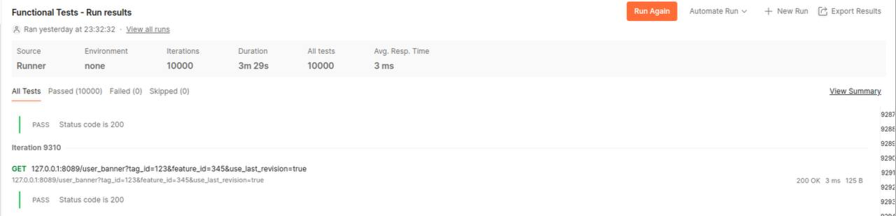

## Привет Читатель!   
Ниже представлен проект “Сервис Баннеров”. Пропустим лирическую часть его описания и предназначения, и перейдем сразу к техническому разбору программы.

## Основные фреймворки и библиотеки:

### Самописный Dependency injection (pkg/di/di.go) 
Все мы любим SOLID-принципы, однако не всегда возможно соблюсти их в полной мере из-за различных ограничений. Поэтому уже при фундаментальном проектировании проекта - к DI стоит уделить особое внимание. Грамотно реализованный DI помогает решить сразу две задачи, связанные с принципами SOLID: SRP и DIP

На вопрос “Зачем нужен свой di, когда существует великолепный ***“wire”*** - могу сказать, только, что это было бы скучно…

### Slog
Эффективный логгер, со своим сериализатором в json и удобным API. Все-таки имеется какая-то магия передачи логгера в контексте по проекту. Так как он настроен на асинхронную работу вывода логов, то каждый лог в проекте имеет, помимо основной нагрузки, свой trace_Id, который поможет цепочку выполнения программы (будет полезно Вам при тестировании).

### Redis
Способ организации кэша - ***cache-aside***. Чтобы оценить, какой кэш, когда лучше использовать, Redis или, например, Memcached, потребуется гораздо больше места, чем может предоставить данный README-файл.

### Echo
В проекте в качестве маршрутизатора применяется фреймворк Echo, который отличается высокой производительностью и лаконичностью. (см ниже Нагрузочное тестирование).

### Gorm
Красивая и удобная ORM-библиотека - предоставляющая весь необходимый функционал для работы с БД. Единственным конкурентом мог выступить ***SQLBoiler***, применяющий кодоген под капотом, но это было бы уже излишеством в данном проекте.

### Docker, Docker-Compose, MySQL, Viper 
Сопровождающие атрибуты проекта. Для визуализации происходящего в БД - можете использовать phpMyAdmin, запущенный на порту 9090 (не обязательно, просто для удобства). 

## Запуск проекта
Для запуска наберите в терминале команду make.   
Она вызовет две цели из makefile - up и logs. Если хотите запустить проект в detached mode, то наберите make up 

## Нагрузочное тестирование

#### Без использования кэширования:

#### С кэшом:

